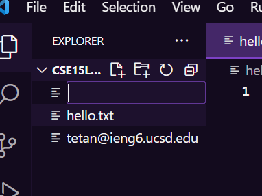
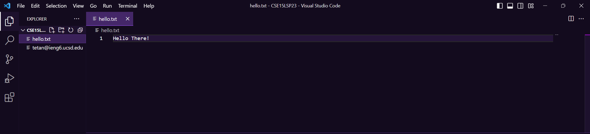
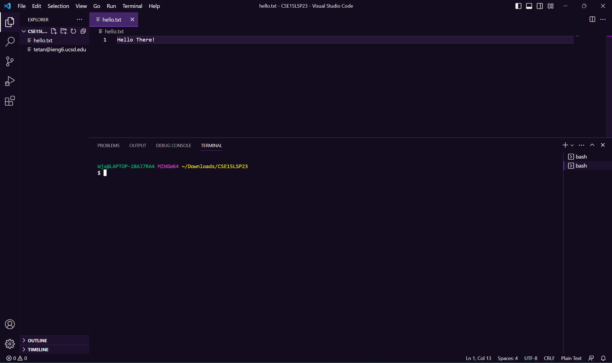
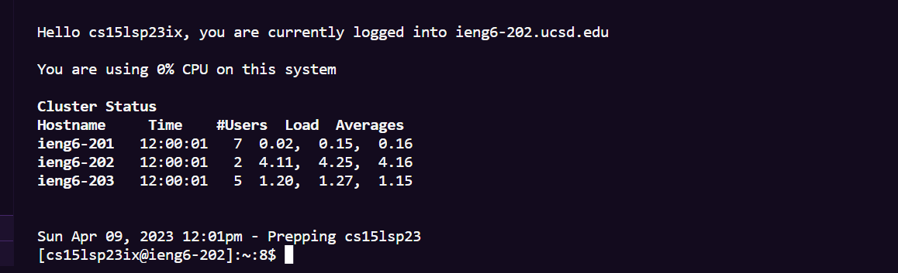

In this post, I will show you how to remote connect on vscode using java.(windows)

First and foremost, you will need to install vscode onto your computer 

Which you can do here, by clicking on this link https://code.visualstudio.com/

Once you have downloaded, you are going into your files on your computer and create a new folder with any name of your choosing!!
For mine I am choosing CSE15LSP23 as my folders name.

After creating the folder, you can now open vscode

You are going to files located on the top right of vscode, and open the new folder you have just created, and create a new file

You can name the file anything you want, for this demonstration mine will be named Hello.txt and will have the following text "Hello There!".

Now, we will being to remote connect, on the bar located on the top right, you will click on terminal, and create a new terminal which should bring it up from the bottom. 

To connect, type in "scp Hello.txt(or the file name you have created) followed by your course specific account", and then type in your password to the account 
Its going to say "Are you sure you want to continue connecting?" In which my professor (joe) would always say yes to when connecting to a new server. After
completing it you should have something like this.:)

After connecting you can type in some commands such as "pwd, "cd", "cd ~", "ls -lat", "ls -a", "ls <directory> where <directory> is", 
  "cat /home/linux/ieng6/cs15lsp23/public/Hello.txt", and many more.
  
To log out run the command exit, or press Ctrl + d.
  
Now you have finished!! :D!!
