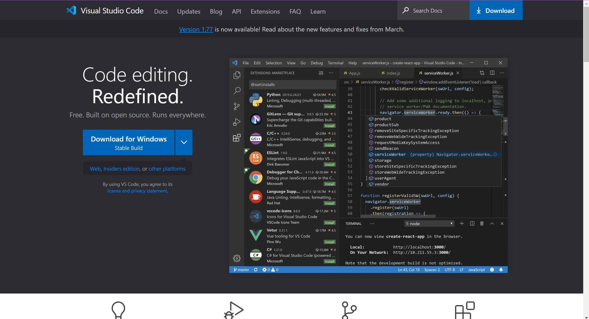
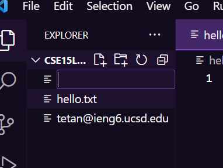
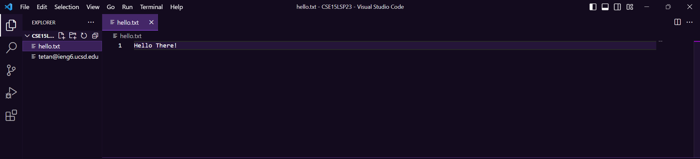

In this post, I will show you how to remote connect on vscode using java.(windows)

First and foremost, you will need to install vscode onto your computer 

Which you can do here, by clicking on this link https://code.visualstudio.com/

Once you have downloaded, you are going into your files on your computer and create a new folder with any name of your choosing!!
For mine I am choosing CSE15LSP23 as my folders name.

After creating the folder, you can now open vscode

You are going to files located on the top right of vscode, and open the new folder you have just created, and create a new file

You can name the file anything you want, for this demonstration mine will be named Hello.txt and will have the following text "Hello There!".

Now, we will being to remote connect, on the bar located on the top right, you will click on terminal, and create a new terminal which should bring it up from the bottom. 

To connect, type in 

····# code block

····ssh cse15lsp23**@ieng6.ucsd.edu(for example)

Its going to show this text in the terminal

····# code block

····The authenticity of host 'ieng6.ucsd.edu (128.54.70.227)' can't be established.
RSA key fingerprint is SHA256:ksruYwhnYH+sySHnHAtLUHngrPEyZTDl/1x99wUQcec.
Are you sure you want to continue connecting (yes/no/[fingerprint])? 
In which my professor (joe) would always say yes to when connecting to a new server. After
completing it you should have something like this.# code block 

After connecting you can type in some commands such as "pwd, "cd", "cd ~", "ls -lat", "ls -a", "ls <directory> where <directory> is", 
"cat /home/linux/ieng6/cs15lsp23/public/Hello.txt", and many more.
Here are a few examples

  
  
  
pwd command(print working directory): prints the working directory as shown in the picture.
  
cd command(Change directory): allows you to change the directory of the files to whatever you would like.As shown in the reference.In which I have typed "cd per15".
Now my working directory is pointing towards per15.
  
cd ~ command: change the directory back previously
  
ls command: shows the list directory contents
  
Again there are many more commands to try out.
  

To log out run the command exit, or press Ctrl + d.
  
Now you have finished!! :D!!
