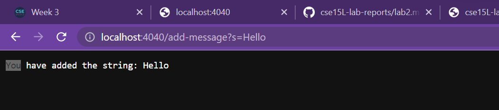

Part 1.

The code for StringSearch:

Adding the two request:
/add-message?s=Hello:

when called the code is going to check its path, since the path contains "/add-message" line 18 will be executed
in which will split the second half from the "=" sign
Since parameter at index 0 equals "s", index 1 of the parameters will be added into the new Arrray list we have created.
On the webserver, it will show the string you have added.
The new Arraylist willnow conatin "Hello"
Since we want to see what path we want to head to , "/add-message" is only specific to that method to add a string 
If we use an Int like 123, it will still be added to the Arraylist, because the first method I have returns every item in the list to a String.

/add-message?s=How are you:

This code will also function the same as the first, but at index 1 the string is different.
Since we have called the same method again, with the same path, the new String should be added into the new Array list
The new Arraylist we have created will now contain "Hello" and "How are you"

result after returning back:

Once you have remove the path, from the search bar, it should now show all the strings you have added into the web server. In which the first method is now called.
returning the Arraylist whih contain "Hello" and "How are you"

Part 2.

One of the bugs we will be fixing up is the method reversed

Here is one the the test method given to us, which when run will give us an OK pass. 

However, all may seem good, but the code has an error in it. When given another test example, the expected value for the parameter[0] is supposed to be 3, but instead it was 0. 

Test failed image:

When, reading throughout the code, we can see a newarray has been created, but nothing is getting added into it. To fix the bug we will simplility rewrite line 20. and return newArray 

Test pass Img, when the test is run again:

and when it is run, all the test have been passed.

This fixed the problem, because we know we have created a newArray, the previous code was only adding in empty slots, because newArray does not have anything in it. By rewriting the line, we are now adding the list of numbers in reverse order to the new Array in which it will return that 
list in a reversed order.The reason the first test problem was able to pass, was because it was an empty list.

Part 3.

One thing I learned thats new today was to create a web server. It was difficult at first
, but I was able to use some of the code we used in lecture and lab as a reference to
writing my webserver. I am a beginner programmer, with not as much knowlegde of coding. I did study a little bit of python.
