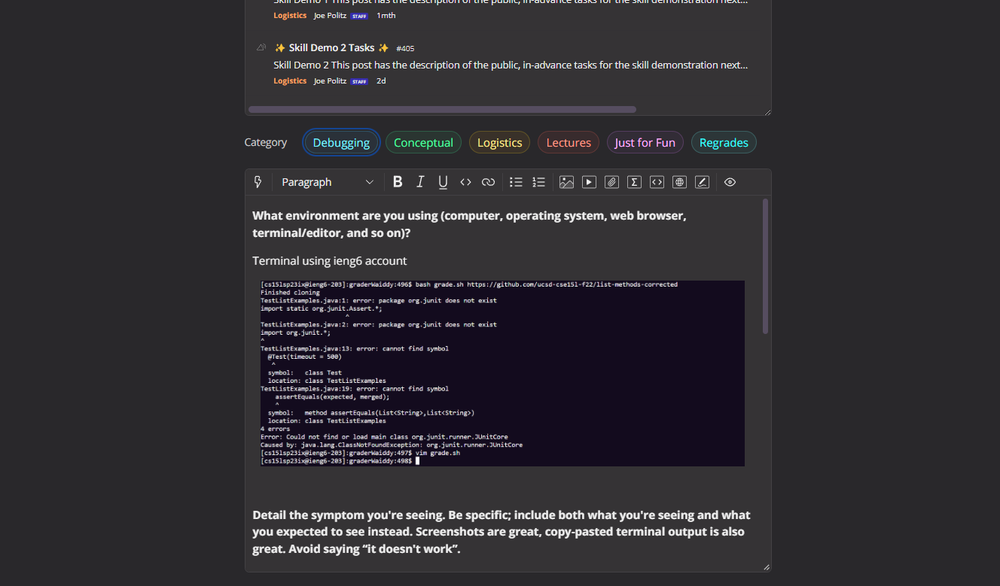
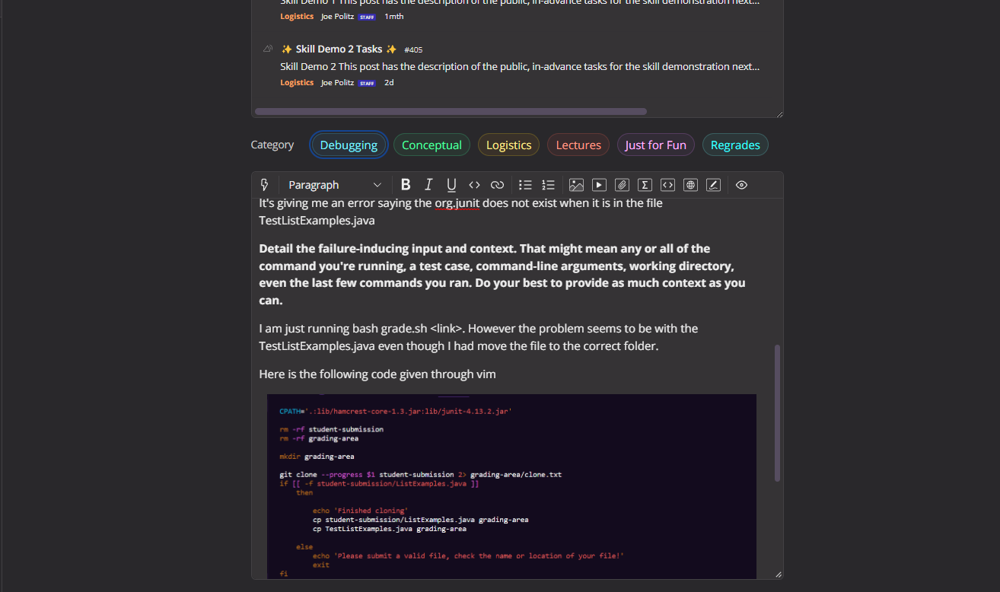
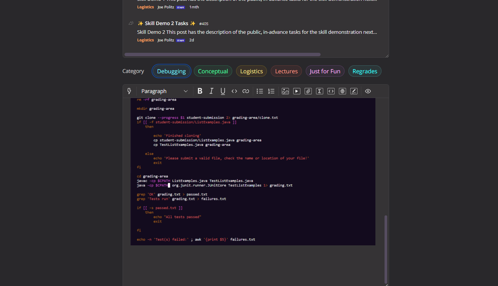

Lab Report 5

2023/06/04

In this lab report we will be going through a conversation between a TA and a student
who is having trouble with their program.


# Student Reporting the error
All students in CSE15L run through a problem with their code more then once, in any course. In this example the student is having
problems tring to get their code to run.

All students in CSE15L can write a post through the course's EdStem:





# TA's Response
What the TA might do is to read through the students problem,
Once read through the TA's first instance is to go through the error given 
in the terminal, then go through the code that is provided by the student.
 
Since the problem is occuring with the file TestListExamples.java
The TA would focus more on the lines that has to do with the Test file
 
Based on the error picture given by the student, The TA might give a response 
that will consider changing the javac and java lines, since it is having trouble 
trying to compile the files
especially the CPATH.
 
What the TA might consider is to change the 
$CPATH to ```../lib/junit-4.13.2.jar:../lib/hamcrest-core-1.3.jar:.``` for both javac and java lines
 
Since the TA is gieven the description that the Student is using vim to edit and see his files.
The TA might include some keys to press and edit it

**Keys such as**

*  < i > to go into insert mode
  
*  < delete > to remove the $CPATH
  
*  < ESC > to exit out on insert mode
  
*  < : > + < w > + < q > to save and exit the file.
 
# Student's fix code
  After typing in the suggested cpath the TA had suggested,
  The student ran some test, and got his expected outputs
  
```
[cs15lsp23ix@ieng6-203]:graderWaiddy:505$ bash grade.sh https://github.com/ucsd-cse15l-f22/list-methods-corrected
Finished cloning
All tests passed
[cs15lsp23ix@ieng6-203]:graderWaiddy:507$ bash grade.sh https://github.com/ucsd-cse15l-f22/list-methods-filename
Please submit a valid file, check the name or location of your file!
[cs15lsp23ix@ieng6-203]:graderWaiddy:508$ bash grade.sh https://github.com/ucsd-cse15l-f22/list-methods-lab3
Finished cloning
Test(s) failed:1
```
  
# Reflection
One thing that I have learned, is how to write the grader test. When we first started on that lab. 
I had a lot of problems writing the codes for it to work. However after a couple more tries, and an other
  lab deticated to writing the grade.sh again. I was able to get some help from my lab TA, and my lab partners.
Also after learning about vim, I have used it constantly when writing codes, I find it very useful and quick. 
especially the search method for a certain word.
  


 
 
 


